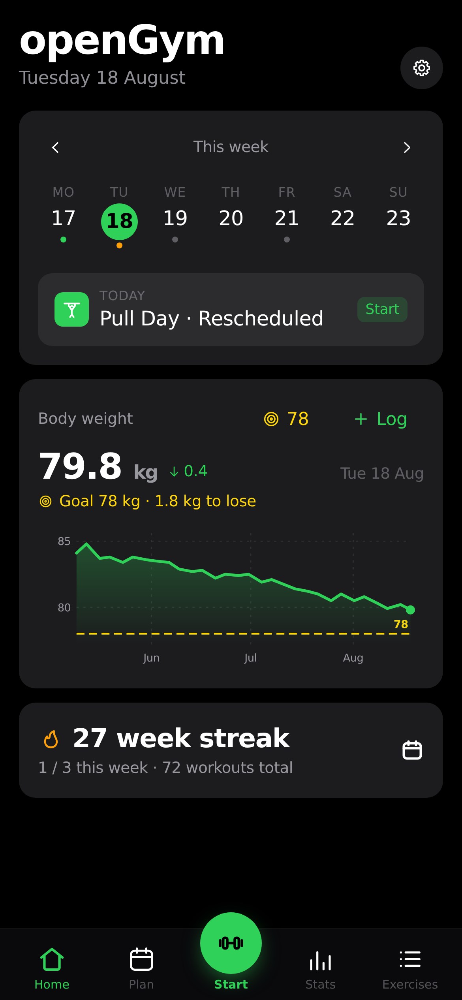
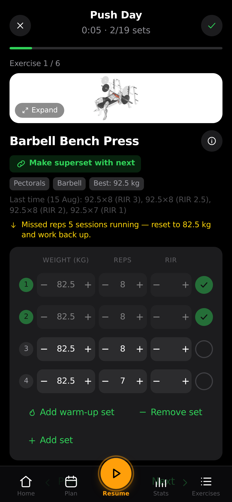
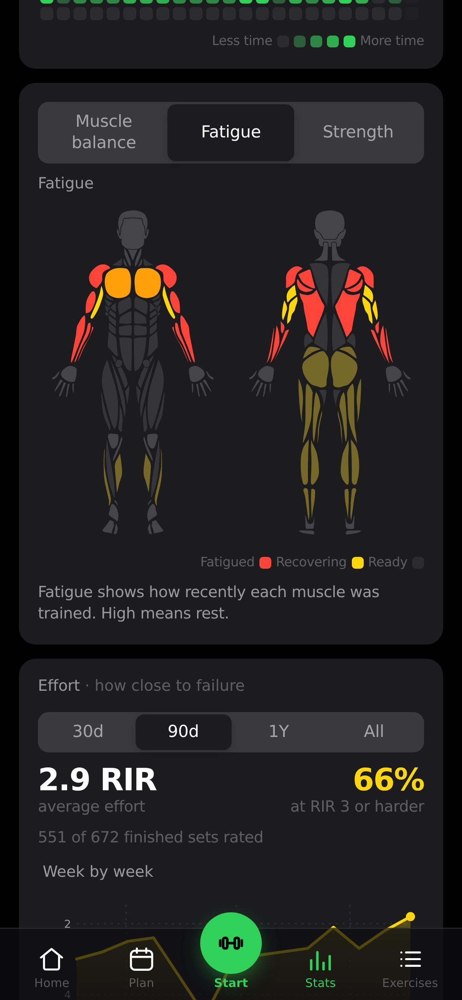

<div align="center">


<br>

**Um rastreador de treinos e peso corporal self-hosted que você realmente controla.**

Planeje sua semana, faça treinos guiados, registre cada série e seu peso corporal ao longo do tempo —
no celular, sincronizado entre dispositivos, atrás do seu próprio login por passkey.
Sem conta no servidor de ninguém, sem assinatura, sem anúncios. Apenas `docker compose up`.

<br>

[](LICENSE)


<br>
[](https://gitlab.com/DuarteSantos8/opengym/-/pipelines)

[](https://gitlab.com/DuarteSantos8/opengym/-/starrers)
[](https://gitlab.com/DuarteSantos8/opengym/-/issues)
[](https://discord.gg/e62jY6fwVb)
[](https://buymeacoffee.com/duartesantos)

</div>

<br>

<div align="center">
<table>
<tr>
<td align="center"><br><sub><b>Início</b> — treino e peso do dia</sub></td>
<td align="center"><br><sub><b>Treino guiado</b> — demos animadas & séries</sub></td>
<td align="center"><br><sub><b>Estatísticas</b> — heatmap, gráficos & recordes</sub></td>
</tr>
</table>
</div>

## Por quê

A maioria dos apps de treino tranca seus dados atrás de um login nos servidores deles, vive
cobrando upgrade, ou desaparece quando a startup acaba. O openGym é o oposto: **roda na sua
máquina, seus dados ficam numa pasta que você controla, e é seu para fazer fork.** E continua
moderno — instalável como app na tela inicial, login por passkey, suporte offline, sync entre
celular e computador.

## Funcionalidades

- ⚖️ **Registro de peso corporal** — gráfico interativo com linha de meta definida por você; ganhos/perdas coloridos conforme se aproximam dela
- 🏋️ **Plano semanal** — uma rotina por dia da semana, sobre uma biblioteca de **1.324 exercícios** (com busca e demos animadas)
- 🗓️ **Remarque qualquer dia** — ficou doente, perdeu um dia ou vai menos à academia esta semana? Mova o treino para outro dia sem mexer no plano semanal
- ▶️ **Treinos guiados** — o app sabe que dia é hoje e inicia a sessão do dia; pede seu peso primeiro, pré-preenche os pesos da última vez, cronômetro de descanso, detecção de recorde, acompanhamento de peso por exercício
- ☀️ **A tela permanece ligada enquanto você treina** — nada de desbloquear o celular e procurar onde parou entre cada série. Ligada enquanto houver treino em andamento, liberada no instante em que você termina, e desativável nas Configurações
- 🔗 **Supersets** — planeje-os numa rotina ou junte dois exercícios *no meio da sessão* com "fazer superset com anterior/próximo", e execute o grupo seguido, com um único descanso ao fim de cada rodada. Desfaça quando quiser; grupo de um se dissolve sozinho
- 🔥 **Séries de aquecimento** — marque as linhas de ramp-up como aquecimento e elas saem dos números que não devem vê-las: sem efeito no 1RM estimado, na progressão ou no mapa de fadiga, mas continuando lá na sessão em que você precisa delas. Uma mudança de peso cascata pelas linhas da mesma fase, não atravessa a divisão
- ➖ **Mude de ideia no meio da sessão** — adicione um exercício que decidiu fazer, ou remova um que não quis, sem encerrar o treino. Remover um membro de superset pergunta qual deles
- ⏱️ **Exercícios cronometrados** — pranchas, hangs, wall sits e carries são registrados por tempo, não repetições, com um timer de trabalho que conta a própria série (separado do descanso) e registra o tempo que você aguentou de verdade. Também podem levar carga
- 📈 **Progressão que segue uma regra** — escolha uma por rotina, sobrescreva por exercício: linear, **Greyskull LP** (série principal AMRAP, saltos duplos, resets de 10 %), progressão dupla num intervalo de reps, ou acrescentando tempo. Seus pesos já estão certos quando a sessão abre, e toda meta diz *por que* é aquele número. Reps perdidas nunca avançam a carga, estagnação dispara deload, e exercícios com o peso do corpo progridem em reps
- 💪 **1RM estimado** — por exercício, a partir da sua melhor série elegível (ele nomeia qual), com curva própria de progresso e uma calculadora para séries ainda não feitas. Não chuta acima de 12 reps
- 🎯 **Esforço por série, na sua escala** — uma terceira coluna opcional avaliando quão dura foi a série, como **RIR** (reps restantes no tanque) ou **RPE** (o mesmo julgamento numa escala de 10 pontos). Desligado por padrão; cada série mantém a escala com que foi registrada, e mais nada lê o valor — progressão e 1RM ficam intactos
- 💪 **Exercícios de peso corporal, registrados como peso corporal** — flexões, barras, paralelas e outros ~300 já chegam sabendo que não carregam carga: sem coluna de peso e sem pedido de peso de trabalho; um stepper, registre as reps. Coloque cinto de lastro e vira adicional, com a progressão voltando a seguir o peso. Sem ele, as reps sobem — e além de um teto que você define, acrescenta-se uma série em vez de uma rep, até o ponto em que o conselho honesto é carregar ou partir para variação mais difícil
- ↔️ **Reps por lado** — para afundos, remada unilateral e afins. Você registra o total, o app mostra a divisão ("8 por lado"), e a meta avança de dois em dois para nunca cair num número que um lado sozinho não alcança
- 🎲 **Sessões livres** — treine sem plano escolhendo exercícios na hora. Cada um chega pré-preenchido da última vez que você o fez — mesmas séries, mesmas reps e peso por posição — para uma sessão improvisada não começar pedindo para redigitar a semana passada
- 🏃 **Cardio** — registre tempo + velocidade, não só peso × reps
- 📤 **Compartilhe um plano** — envie a alguém suas rotinas e agenda semanal como um pequeno arquivo (sem treinos, sem pesagens), ou imprima como um PDF limpo. A importação faz merge, então o plano do outro nunca é sobrescrito
- 🔧 **Filtre por equipamento** — estreite a biblioteca ao que você realmente tem; as opções se adaptam ao que você escolheu, então toda combinação na tela tem resultados por trás
- ✨ **Seus próprios exercícios** — um nome e uma parte do corpo bastam; comportam-se como nativos em todo lugar, com descrição opcional no lugar da animação
- 🟩 **Heatmap de atividade** — visão anual estilo GitHub, sombreada pelo tempo treinado
- 💪 **Mapa muscular, três leituras** — um diagrama frontal/traseiro do corpo legível como **Equilíbrio** (para onde foi o volume, numa semana, mês ou tudo — nomeando os músculos que você *não* treinou), **Fadiga** (o que ainda está se recuperando, ponderado pela proximidade de cada série do seu máximo, decaindo suave em vez de expirar na borda da janela) ou **Força** (quanto tempo desde o último treino de cada músculo, e por trás de cada um os exercícios que o construíram com o 1RM estimado dele). Pré-visualiza o que uma rotina atinge enquanto você a monta, e mostra o que acabou de treinar ao finalizar. Figura masculina ou feminina, sua escolha
- 🔔 **Notificações push** — alertas do cronômetro de descanso mesmo com o app fechado, mais um lembrete opcional nos dias com treino planejado e nada registrado. Ativação por perfil; chaves geradas no primeiro boot, nada a configurar
- 🔑 **Passkeys, não senhas** — Face ID / Touch ID / digital; cada perfil guarda os próprios dados, sincronizados entre dispositivos. Sessões duram 90 dias por padrão (configurável), e "encerrar sessão em todos os dispositivos" nas Configurações encerra cada sessão em todos os aparelhos de uma vez
- 🛠️ **Painel admin** (opcional) — para quem opera a instância: quem está treinando agora, histórico por usuário, desativar contas, cadastro só por convite, e um **log de atividade** com logins, tentativas falhas e ações administrativas. Desligado por padrão, então uma instância nova fica aberta e sem admin
- 🎨 **Projetado, não montado** — temas claro/escuro e 8 cores de destaque salvos no perfil, sobre um conjunto de ícones desenhados à mão em vez de emoji, para ficar igual em qualquer celular
- 🌍 **12 idiomas** — tradução completa da interface (EN, DE, ES, FR, IT, PT-BR, PL, TR, RU, ZH, KO, HI); instruções dos exercícios localizadas em 10 deles, carregadas sob demanda para o app continuar rápido
- 📥 **Traga seu histórico** — importe de **FitNotes** (Android e iOS), **Strong** e **Hevy**, ou o peso direto de uma exportação do **Apple Health**. Nomes de exercícios casam com a biblioteca e o que não for reconhecido vira um exercício seu, então nada do arquivo é descartado
- 📦 **Seus para sempre** — exportação/importação JSON num toque, modo convidado, **zero telemetria**
- 🤖 **Pergunte a uma IA sobre seu treino** (opcional) — um [servidor MCP](mcp/README.md) permite a um cliente como Claude Desktop ou Cursor ler seu histórico com suas palavras: *"quanto eu pus no supino semana passada?"*. Somente leitura, executado localmente pelo cliente, nada sai da sua máquina. Fora do build Docker — se você não usa assistente de IA, ele simplesmente não está lá
- 📱 **App Android autônomo** — o rastreador inteiro como APK instalável: sem conta, sem servidor, dados no celular, lembretes nativos de treino ([download](https://opengym.duarte-santos.ch))

## Começo rápido (self-host)

Você precisa de [Docker](https://docs.docker.com/get-docker/) com Compose.

```bash
git clone https://gitlab.com/DuarteSantos8/opengym
cd openGym
cp .env.example .env
docker compose pull   # baixa imagens pré-construídas (amd64 + arm64) — pule para construir do código
docker compose up -d
```

Abra **http://localhost:8080**, toque em **Criar perfil**, e pronto. O primeiro acesso baixa
as mídias dos exercícios (~140 MB) uma única vez.

> **Sobre essa mídia:** ela chega ao openGym via
> [hasaneyldrm/exercises-dataset](https://github.com/hasaneyldrm/exercises-dataset), que
> redistribui [ExerciseDB v1](https://exercisedb.dev/) — os metadados e textos de instrução são
> MIT, mas imagens e animações são conteúdo de terceiros sob licença *nem* MIT *nem* AGPL do
> openGym, e a titularidade está em disputa entre Gym visual e ExerciseDB. O openGym não as
> distribui: sua instância baixa direto da origem. Reutilizar essa mídia por conta própria,
> comercialmente ou não, exige acerto com o detentor dos direitos — veja [NOTICE.md](NOTICE.md).
Prefere construir as imagens você mesmo em vez de baixar do registry do GitLab? Remova o passo
`pull` e rode `docker compose up -d --build` — você não precisa de Node nem de etapa local de
build de qualquer forma.

> Quer acessar pelo celular pela internet com passkeys? Vai precisar de um domínio HTTPS —
> mudança de duas linhas no `.env`. Veja **[docs/SELF_HOSTING.md](docs/SELF_HOSTING.md)**.

## Deploy gerenciado: Supabase + Railway (ou Vercel)

Não quer manter um servidor? Suba o **banco de dados no Supabase** (Postgres gratuito) e a
aplicação no **Railway** — o frontend também pode ficar na Vercel. Passo a passo completo:
**[docs/DEPLOY.md](docs/DEPLOY.md)**. Basta definir `DATABASE_URL` que a API troca os arquivos
JSON pelo Postgres automaticamente (as tabelas são criadas no primeiro boot).

## App mobile (nenhum servidor)

A mesma base de código também gera um **app mobile autônomo** (Capacitor): sem conta, sem sync,
sem backend — tudo fica no celular, com lembretes nativos de dia de treino e backups via share
sheet. Self-host te dá multi-dispositivo e perfis para amigos e família; o app mobile é a versão
instalar-e-pronto.

- **Android:** [**baixe o APK**](https://opengym.duarte-santos.ch) — ou direto do
  [registry de pacotes do GitLab](https://gitlab.com/DuarteSantos8/opengym/-/packages), onde todo
  build fica junto do seu `.sha256` — e instale por sideload; o openGym propositalmente não está
  na Play Store. Ou construa você mesmo: **[docs/MOBILE.md](docs/MOBILE.md)**.
- **iPhone:** a Apple não permite instalar apps fora da App Store, então não há download iOS.
  Faça self-host e adicione à tela inicial pelo Safari (é uma PWA completa), ou compile o app
  nativo no seu aparelho via Xcode — veja **[docs/MOBILE.md](docs/MOBILE.md)**.

## Como funciona

```
┌─────────────┐        ┌──────────────────────────────┐
│ Seu celular │──HTTPS─▶│  web  (nginx)                │
│ / notebook  │        │   ├─ serve o app compilado   │
└─────────────┘        │   └─ proxifica /api ────────┐│
                       └──────────────────────────────┘│
                                                       ▼
                                       ┌──────────────────────────┐
                                       │  api  (Node + WebAuthn)  │
                                       │  └─ ./data (JSON) ou     │
                                       │     Postgres/Supabase    │
                                       └──────────────────────────┘
```

- **frontend/** — React + Vite (React Router + Zustand), compilado para arquivos estáticos **dentro do Docker**
- **api/** — Node sem framework, duas dependências (`@simplewebauthn/server` para passkeys, `web-push` para notificações), guardando tudo como JSON puro em `./data` — ou no Postgres quando `DATABASE_URL` está definida ([docs/DEPLOY.md](docs/DEPLOY.md))
- **web/** — imagem multi-stage que compila o frontend e serve com nginx, proxificando `/api` para o backend para ficar tudo em **uma origem** (passkeys exigem isso)

## Seus dados

Em modo docker, vivem em `./data` no host: `db.json` (perfis + passkeys públicas),
`state-<user>.json` (plano, treinos, peso e configurações de cada usuário), `audit.log`
(log de atividade do admin — logins e ações administrativas, sem endereços IP a menos que você
peça) e `secret` (chave dos cookies de sessão).
**Faça backup de `./data` e você fez backup de tudo.** Em modo Supabase/Postgres, o mesmo vive
nas tabelas `app_kv`, `user_state` e `audit_events` — backup do banco cobre tudo.
Chaves privadas das passkeys jamais tocam o servidor — ficam no secure hardware do seu celular /
no seu gerenciador de senhas.

## Configuração

Tudo via `.env` (veja [.env.example](.env.example)):

| Variável      | O que é                                              | Padrão                  |
|---------------|------------------------------------------------------|-------------------------|
| `DATABASE_URL`| Connection string Postgres (Supabase etc.); sem ela, arquivos JSON | *(arquivos)* |
| `RP_ID`       | Hostname ao qual as passkeys ficam vinculadas         | `localhost`             |
| `ORIGIN`      | URL completa de onde o app é servido                  | `http://localhost:8080` |
| `WEB_PORT`    | Porta do host para a UI web                           | `8080`                  |
| `NGINX_PORT`  | Porta que o container web escuta, dentro do container | `80`                    |
| `BACKEND`     | Nome do serviço de API para onde `/api` é proxificado — mude se o seu não se chama `api` | `api` |
| `PORT`        | Porta que a API escuta; o container web proxifica para o mesmo valor | `3000`  |
| `RP_NAME`     | Nome mostrado no prompt da passkey                    | `openGym`               |
| `SESSION_DAYS`| Duração de uma sessão, em dias                        | `90`                    |
| `ADMIN_UIDS`  | Ids de usuário que recebem o painel admin (separados por vírgula) | *(nenhum)*   |
| `INVITE_ONLY` | Exigir código de convite para criar perfil            | *(desligado)*           |
| `ALLOW_GUEST` | Oferecer "Continuar sem conta" — use `0` para exigir perfil | *(ligado)*        |
| `AUDIT_LOG`   | Registrar logins e ações admin — use `0` para nada    | *(ligado)*              |
| `AUDIT_MAX`   | Eventos guardados no log de atividade; `0` = sem limite | `5000`                |
| `AUDIT_DAYS`  | Dias guardados no log; `0` = guardar até `AUDIT_MAX`  | `90`                    |
| `AUDIT_IP`    | Registrar endereço do chamante: `off`, `net` (só rede) ou `full` | `off`        |
| `VAPID_SUBJECT` | URL de contato enviada com as notificações push     | sua `ORIGIN`            |

As chaves de push são geradas no primeiro boot e salvas em `./data/vapid.json` — nada a definir.
`DATA_DIR` é fixada em `/data` pelo `docker-compose.yml` e mapeada para `./data` no host; mude o
lado do host desse volume, não a variável.

## Roadmap

Raso e guiado pela comunidade — ideias e PRs bem-vindos:

- [x] App mobile autônomo — APK Android para sideload ([download](https://opengym.duarte-santos.ch)); no iOS como PWA self-hosted (sem planos de loja)
- [x] Programas de progressão automática (linear, Greyskull LP, progressão dupla) com estagnações e deloads
- [x] 1RM estimado por exercício
- [ ] Programação por percentuais / training-max (estilo 5/3/1) sobre o motor de progressão
- [ ] Mais planos iniciais (upper/lower, full-body, 5×5)
- [x] Importadores de FitNotes / Strong / Hevy (incluindo o RPE que eles registram), e peso corporal do Apple Health
- [x] Esforço por série — RIR ou RPE, a escala em que você pensa
- [ ] Medidas corporais (cintura, braços…) junto do peso
- [ ] Notas por exercício & calculadora de anilhas
- [ ] Instruções dos exercícios em alemão & português (a UI é traduzida; o dataset upstream ainda não traz esses idiomas)

## Tecnologia

React 19 + Vite (React Router, Zustand) · Node (sem framework) · nginx · Docker Compose ·
WebAuthn · dados dos exercícios de [hasaneyldrm/exercises-dataset](https://github.com/hasaneyldrm/exercises-dataset)
(metadados e instruções MIT; mídia © Gym visual — veja [Licença](#licença)).
Sem servidor de banco, sem dependências de nuvem — o frontend compila dentro do Docker, então o
self-host continua sendo um `docker compose up`. Quando `DATABASE_URL` existe, o armazenamento
vai para Postgres (Supabase/Railway) sem mudar mais nada.

A lógica de treino — regras de progressão, estimativa de 1RM, como uma sessão registrada é lida
de volta — vive em funções puras em `frontend/src/lib/` com testes ao lado: `npm test` em
`frontend/`. Vitest é dependência de desenvolvimento; o app em si não embarca dependências de
runtime além de React, router e Zustand.

Os mesmos helpers puros alimentam um servidor MCP opcional (`mcp/`) que deixa um cliente LLM como
Claude Desktop ler seus dados via stdio — veja [mcp/README.md](mcp/README.md). Opt-in, fora do
build Docker.

## Comunidade

- **[Discord](https://discord.gg/e62jY6fwVb)** — anúncios de release, ajuda com self-hosting e a
  conversa que seria uma issue lenta. Caminho mais rápido para uma resposta.
- **[Issues](https://gitlab.com/DuarteSantos8/opengym/-/issues)** — bugs, perguntas, ajuda com
  self-hosting e ideias. Não há Discussions aqui, então tudo mora num único tracker: marque uma
  pergunta com `question` e uma ideia com `idea`, e ela será tratada como tal, não como trabalho
  combinado. Prefira issue ao Discord para qualquer coisa que a próxima pessoa deva encontrar buscando.
- **Problema de login?** Na maioria das vezes é um `RP_ID`/`ORIGIN` divergentes — confira
  [docs/SELF_HOSTING.md](docs/SELF_HOSTING.md) antes de abrir issue.
- **Merge requests** — [abra um no GitLab](https://gitlab.com/DuarteSantos8/opengym/-/merge_requests); veja
  [CONTRIBUTING.md](CONTRIBUTING.md).

> **Sobre o repo GitHub:** `github.com/DuarteSantos8/openGym` está offline porque a conta foi
> suspensa. **O GitLab é a casa do projeto** — mesmo histórico, mesmas tags, mesmos releases, e
> a CI que constrói imagens e APK roda lá. (gitea.com/DuarteSantos/openGym foi o primeiro
> paliativo e hoje é só espelho.) Números antigos de issues/PRs do GitHub em
> [CHANGELOG.md](CHANGELOG.md) ficam como referência pura; eles não correspondem à numeração do
> GitLab.

## Contribuir

Issues e PRs bem-vindos — veja [CONTRIBUTING.md](CONTRIBUTING.md). Boas primeiras issues: mais
planos iniciais, idiomas dos dados de exercícios, importação de outros rastreadores.
**Uma ⭐ ajuda mais gente a achar o projeto.**

O openGym é livre e segue livre: AGPL, sem assinatura, sem tier pago, nada retido para
patrocinadores. Se ele substituiu um rastreador pago para você e quer contribuir, há um botão de
café abaixo (e um badge lá em cima) — uma estrela, um relato de bug ou um merge request valem
tanto quanto.

<!-- O GitLab não tem botão Sponsor como o FUNDING.yml do GitHub dava, então o link precisa
     ficar por si. .github/FUNDING.yml fica onde está para o dia em que a conta voltar. -->

<a href="https://buymeacoffee.com/duartesantos" target="_blank">
  
</a>

## Licença

**O código próprio do openGym** é [GNU AGPL v3.0](LICENSE) — livre e open source. Você pode
self-hospedar, usar, modificar e compartilhar; se rodar uma versão modificada como serviço de
rede, deve oferecer o código-fonte dessa versão sob a mesma licença. Ninguém pode transformar o
openGym num produto fechado e proprietário.

**Conteúdo de terceiros não é, e o openGym não pode sublicenciá-lo.** Os metadados e textos de
instrução dos exercícios vêm de [ExerciseDB v1](https://exercisedb.dev/) e chegam ao openGym via
[hasaneyldrm/exercises-dataset](https://github.com/hasaneyldrm/exercises-dataset) sob licença
**MIT**. As imagens e animações são conteúdo de terceiros cobertos nem por essa licença nem pela
AGPL, e sua titularidade está **atualmente indefinida** — o dataset upstream as atribui a
[Gym visual](https://gymvisual.com/) sob uma permissão não transferível, enquanto
[ExerciseDB/AscendAPI](https://exercisedb.io/faq) afirma ser seu criador e dono. Uma clarificação
foi solicitada. O openGym não as redistribui (sua instância as baixa no primeiro uso) e não
relincencia. Para reutilizar essa mídia, acerte com o detentor dos direitos primeiro.

Avisos completos de terceiros, incluindo a geometria do diagrama corporal: **[NOTICE.md](NOTICE.md)**.
